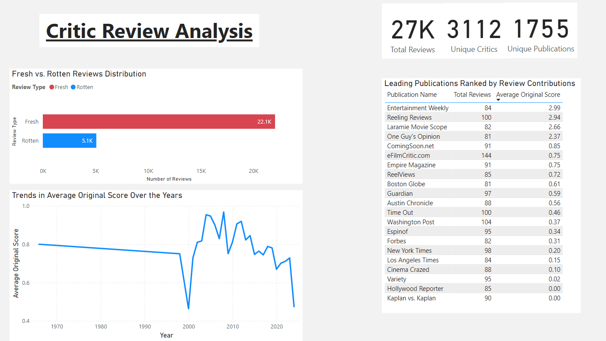

# **Critic Reviews Analysis**

## **Overview**
This project analyzes a dataset of movie critic reviews to uncover insights into sentiment trends, influential critics, and publication behavior. By leveraging Python for data processing, MySQL for querying, and Power BI for visualization, the project delivers actionable insights into how movies are reviewed across time and by different critics and publications.

---

---

## **Objectives**
The primary goals of this project are:
1. **Review Sentiment Analysis**:
   - Analyze trends in positive (`fresh`) vs. negative (`rotten`) reviews over time.
   - Identify periods of significant sentiment change for movies or genres.
2. **Critic and Publication Profiling**:
   - Profile critics and publications to determine which are the most influential, lenient, or harsh.
3. **Movie-Specific Insights**:
   - Explore which movies received the most polarizing reviews based on sentiment and score variations.
4. **Sentiment Patterns**:
   - Identify keywords or phrases associated with positive or negative reviews.
   - Correlate `originalScore` with review sentiments to determine patterns.
5. **Publication Impact**:
   - Investigate which publications align with critic and audience preferences.

---

## **User Stories**
### **Review Sentiment Analysis**
1. **As a Data Analyst**,  
   I want to analyze the trend of positive (`fresh`) vs. negative (`rotten`) reviews over time,  
   So that I can identify periods of significant sentiment change.

2. **As a Movie Studio Executive**,  
   I want to identify which movies received the most polarizing reviews,  
   So that I can learn from audience reactions to improve future productions.

### **Critic and Publication Profiles**
3. **As a Marketing Manager**,  
   I want to know which publications are the most lenient or harsh in their reviews,  
   So that I can target the right outlets for promotional efforts.

4. **As a Film Enthusiast**,  
   I want to explore which critics are most influential (`isTopCritic`),  
   So that I can prioritize their opinions when choosing movies to watch.

### **Sentiment Insights**
5. **As a Data Scientist**,  
   I want to identify common keywords in positive and negative reviews,  
   So that I can understand what drives sentiment in critic quotes.

6. **As a Data Analyst**,  
   I want to compare review sentiments across publications and critics,  
   So that I can see which sources are more critical or favorable.

---

## **Dataset**
### **Source**:
- Dataset: `https://www.kaggle.com/datasets/bwandowando/rotten-tomatoesall-time-best-super-hero-movies`
- Key Columns:
  - `reviewId`: Unique identifier for each review.
  - `creationDate`: Date the review was written.
  - `criticName`: Name of the critic.
  - `reviewState`: Sentiment (`fresh` or `rotten`).
  - `isTopCritic`: Whether the critic is a top critic.
  - `quote`: Text of the review.
  - `originalScore`: Numerical score assigned by the critic.
  - `movieId`: Unique identifier for the movie.

### **Potential Data Challenges**:
- Missing values in certain columns (e.g., `quote`, `originalScore`).
- Understanding the format and meaning of `movieId`.

---

## **Tools Used**
- **Python**:
  - Data cleaning and analysis using `pandas`, `matplotlib`, and `seaborn`.
  - Sentiment analysis and keyword extraction.
- **MySQL**:
  - Storing and querying data for analysis.
- **Power BI**:
  - Creating interactive dashboards to visualize insights.

---

## **Steps to Reproduce**
1. **Data Preparation**:
   - Load and clean the dataset using Python.
   - Handle missing values and normalize columns as needed.
   - Export the cleaned data to a MySQL database.

2. **Data Analysis**:
   - Use MySQL to run queries and generate insights:
     - Trends in sentiment (`fresh` vs. `rotten`).
     - Average scores by publication or critic.

3. **Visualization**:
   - Import cleaned data into Power BI.
   - Create dashboards for:
     - Sentiment trends over time.
     - Influential critics and publications.

---

## **Visualizations**
- Sentiment Trends Over Time (Line Chart)
- Top Critics by Review Count (Bar Chart)
- Most Polarizing Movies (Table or Scatter Plot)
- Keyword Analysis in Positive/Negative Reviews (Word Cloud)

---

## **Next Steps**
- Extend the project by integrating metadata for movies (e.g., genres, budgets, box office revenue).
- Conduct a more detailed sentiment analysis using NLP techniques on `quote`.

---

## **Conclusion**
This project provides valuable insights into movie reviews, showcasing how critic sentiment evolves, the influence of top critics and publications, and the factors driving positive or negative reception. It demonstrates the application of Python, SQL, and Power BI for end-to-end data analysis and visualization.

---

## **Contact**
For questions or feedback, feel free to reach out via:
- GitHub: https://ngobt.github.io
- LinkedIn: https://www.linkedin.com/in/brandonngo24/

---
